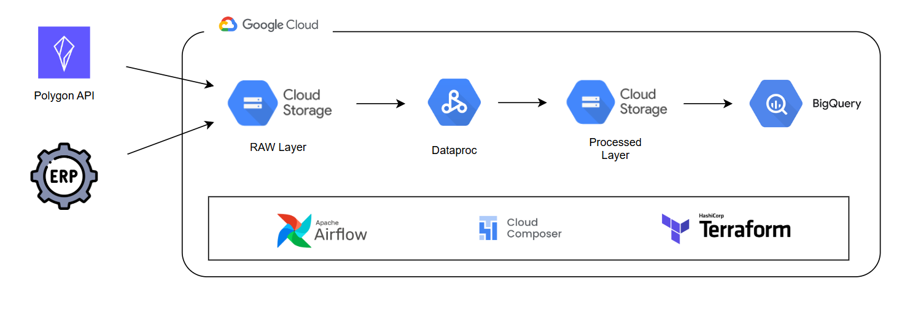

# Stock Market Analysis Data Pipeline

A fully serverless data pipeline that centralizes and prepares stock market data from your selected companies. It's based on a modern and scalable data architecture for ingesting, transforming, and analyzing stock market data using GCS, PySpark, BigQuery, Composer (Airflow), and Terraform.

Data source extraction is automated for daily retrieval of stock price information from the [Polygon.io API](https://polygon.io/). Then, it is processed and modeled using PySpark and loaded into a modern data warehouse with a dimensional model for analytics and visualization.

The architecture is based on Google Cloud Services and deployed using Terraform as IaC.

## Dataset

[Polygon API](https://polygon.io/) provides a free tier for this kind of project. There exist some limitations but we can extract the previous day stock price of 5 companies every minute.

By default we are fetching data from MAANG companies, but you can provide your preferred companies introducing its symbol when it is asked to.

## Tools and Technologies

- **Google Cloud Storage:** Data lake to store the data files in two layers: Raw and Processed with Parquet files.
- **Dataproc Serverless (PySpark):** Handles data transformation and formatting into a dimensional model.
- **Google BigQuery:** Analytical data warehouse and dashboard backend.
- **Google Composer (Airflow):** Orchestrates the end-to-end data workflow on a daily schedule.
- **Terraform:** Manages infrastructure as code to deploy all cloud resources.

## Data Architecture

### Tech Architecture



**Data Sources**

- **Polygon API:** The main data source. It provides transactional data to our pipeline.
- **ERP:** We simulate a second data source as it's leaving CSV files into the raw layer of the data lake. It contains information about several companies and exchanges.

> [!NOTE]
> If any of your selected companies is not included in `data/erp_companies.csv` file be free to add it.

### Dimensional Model


- **fact_stock_price:** This is the central fact table that records daily stock price metrics such as open, close, high, low, and volume. Each record is linked to a specific company, exchange, and date via foreign keys. Its data is fetched from Polygon API and added to the table every time the process runs.
- **dim_company:** A dimension table that stores information about companies. It is loaded from the ERP file before transformations. The data is loaded adfter truncating the table.
- **dim_exchange:** A dimension table that stores information stock exchanges. It is loaded from the ERP file before transformations. The data is loaded adfter truncating the table.
- **dim_date:** A standard date dimension table that provides useful time attributes. It is loaded from an already prepared CSV file.

## Setup

> [!WARNING]
> Please be aware that this project deploys and runs Google cloud services that may incur charges.

### Pre-requisites

> [!NOTE]
> Skip the following steps if they are already done.

- [GCP Account and gcloud CLI installation](setup/gcp_setup.md)

- [Terraform installation](https://developer.hashicorp.com/terraform/tutorials/aws-get-started/install-cli)

- [Polygon API account creation](https://polygon.io/)

### Deployment

- Clone git repo:

```
git clone
```

- Go into infra directory:

```
cd financial-market-data-pipeline/infra
```

- Set project ID, service_account, and polygon key in infra/variables.tf file

MAANG companies. If you want to analize other companes, change the symbols...

- Initiate terraform and download dependencies:

```
terraform init
```

- View the Terraform plan:

```
terraform plan
```

> [!NOTE]
> While it's possible to create a Dataproc cluster manually, this project takes advantage of Airflow to automate the entire process: from provisioning the Dataproc cluster, running the PySpark job, to automatically delete the cluster once the job is complete.

- Create the resources:

```
terraform apply
```

- Type `yes` to confirm. The environment could take 20-25 minutes to be completely deployed.

- Log in into GCP Console and go to Composer service.

- To activate the Composer sensor, upload the provided erp_companies.csv file:

```
gsutil cp ../data/erp_companies.csv gs://datalake-stock-market-bucket/raw/ERP/
```

- When all the tasks are finished, you will be able to see raw and processed data inside GCS and to run queries in the dimensial model on BigQuery.

- Once you are done with the project, finish the cloud services:

```
terraform destroy
```

## Future improvements

- Create dashboard for visualization
- Implement more data validation checks
- Add logging and alerts
- Automate pipeline deployment with CI/CD

## References

- https://medium.com/@williamwarley/a-complete-guide-to-deploy-main-services-in-gcp-with-terraform-f16f18655ca8
